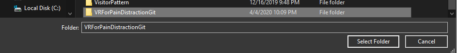
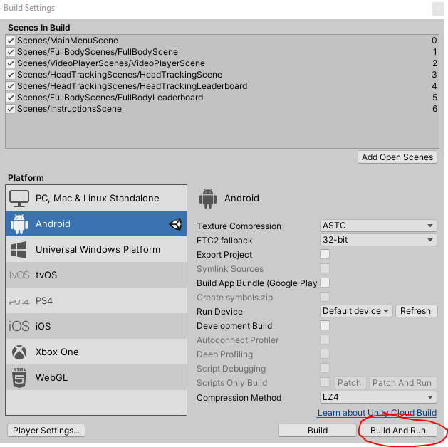

<h1>Prerequisites</h1>

The following hardware is required:

1. Oculus Quest Headset

2. Oculus Touch Controllers

Please ensure you have the following software installed on your system:

1.	Unity Hub v2.2.2

2.	Unity Version 2019.3.0f3 or higher

3.	Have a Unity account with a valid licence.

4.	Git

5.	Oculus app on a smartphone

6.	Oculus account which is connected to your Oculus Quest.

<h1>Downloading Relevant Files</h1>

The project files can be downloaded via Strathclyde’s Gitlab by cloning the repository by using the following command in the folder you wish to contain the files:

git clone https://gitlab.cis.strath.ac.uk/hsb16145/vrforpaindistraction.git

<h1>Setting Up Unity Project</h1>

Once the relevant files have been imported, we need to set up the Unity project. To do this several steps have to be followed.

•	Open Unity Hub

•	Press the “ADD” button in the “Projects section in Unity Hub

•	Once this has been done, locate the folder where the relevant project files have been stored and click “Select Folder”.

•	This will create a project file in Unity Hub with the corresponding file name.

•	Select this file within Unity Hub by left clicking on the project name, this will start creating the project inside unity. This may take a few minutes.

<h1>Building the Project on the Oculus Quest</h1>

Once the project is open in Unity, we need to switch the deployment platform to android. To do this go to:

•	File

•	Build Settings

•	Click on Android

•	Click Switch Platform

•	This may take a few minutes or longer. While waiting, power on your Oculus Quest device, which is connected to the app on your smartphone

•	Open the smart phone app

•	Click “Settings” in the bottom right corner

•	Click on “More Settings”

•	Click on “Developer Mode”

•	Activate “Developer mode” by clicking on the slider

•	Once Unity has finished switching platform from PC to Android

•	Connect your Oculus Quest to your PC using an appropriate connector.

•	Then put on your Oculus Quest headset, you will be met with a message saying whether you would like to enable USB debugging, Select Yes.

•	Press “Build and Run”

•	This will build the device on the Oculus Quest and run it.

If you wish to access the application within the Oculus Quest device instead of getting Unity to run it for you follow the following steps:

•	Point and press the trigger button your Oculus Touch Controller to select menu options

•	Select the library

•	Then Select “Unknown Sources”

•	Select your project’s name

•	This will launch the application.

<h1>Maintenance</h1>

All files that are used in the actual environment are stored in the “Assets” Folder.

If you need to edit anything about the project itself, the relevant assets will be stored in the assets folder, such as scenes, scripts, prefabs and textures.

Scripts are available in Assets > Scripts. To find scripts relating a specific environment, navigate to the relevant folder.

Double click on the script you wish to edit, this will open it in the IDE you have set up in Unity, by default, Visual Studio will be opened if you installed it with Unity, otherwise you will have to go to the project settings to change this to IDE you wish to work with, however Visual Studio is highly recommended as it comes with built in support with Unity. 

